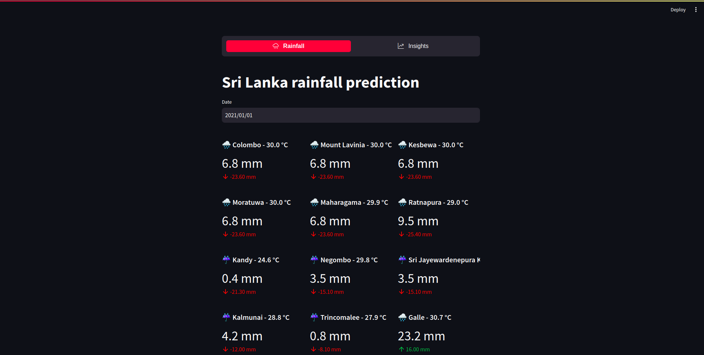
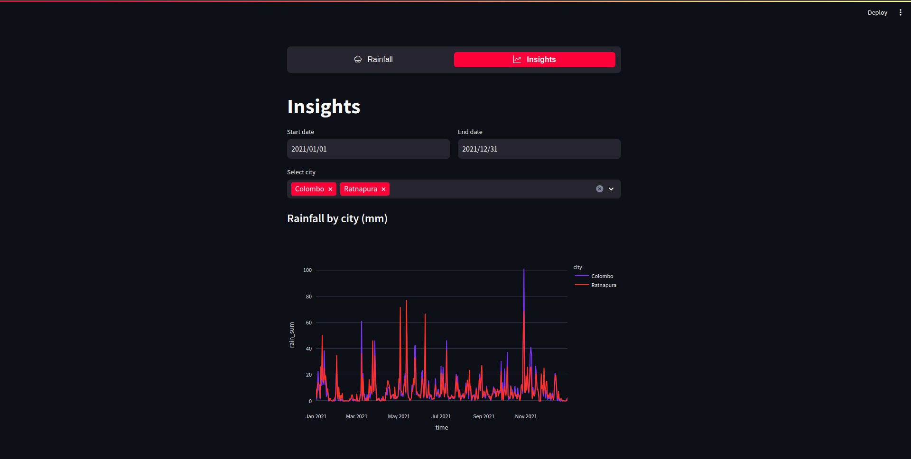

# Stats For Data Science Course Work
This repository was created for statistics for data science coursework.

# Weather Forecaster Application 
Rainfall and Temperature predictor application.
 

## Streamlit Application ( Weather Dashboard )
1) Dashboard link -> https://weather-predictor-sl-ca483e1bb0cf.herokuapp.com/
 

## Application Reporsitory Link
1) Main Repo link -> https://github.com/AVDiv/weather-predictor-dashboard
 

## Instructions To Use The Dashboard
1) Rainfall Tab
- Select the date to view weather records.
- Past Weather stats are available from 2020/01/02 to 2023/06/17 for 30 cities.
- Predictions stats are available from 2023/06/18 to 2023/08/07.
2) Insights Tab
- Select the start date and end date.
- Select the city / cities that you need.
- View the seasonal forecast graphs for rainfall and temperature.

